# Programmable Wireless Sales Engineer Demo

The purpose of this repository is to provide a use case specific demo using the Programmable Wireless product. The use case chosen is industrial/home monitoring using a temperature and humidity sensor.

### Requirements
1. [Twilio Programmable Wireless SIM](https://www.twilio.com/console/wireless/orders/new)
2. [Seeed Wio LTE](https://www.seeedstudio.com/Wio-LTE-US-Version-4G%2C-Cat.1%2C-GNSS%2C-JavaScript%28Espruino%29-Compatible-p-2957.html)
3. [Temperature and Humidity Grove sensor](https://www.seeedstudio.com/Grove-Temperature-%26amp%3B-Humidity-Sensor-%EF%BC%88DHT11%EF%BC%89-p-745.html)

### Table of Contents

1.  [Use case overview](#use-case-overview)
2.  [Programmable Wireless concepts](#programmable-wireless-concepts)
3.  [Registering a Twilio SIM card](#registering-a-twilio-sim-card)
4.  [Installation](#installation)
5.  [Dashboard](#dashboard)
6.  [Hardware](#hardware)

### Use case overview

**Problem** As businesses grow, they often have trouble tracking their inventory or monitoring their storage or production environment. If they had a low-cost, reliable, and technical remote inventory monitoring solution, they could predict production needs and protect their products, increasing both efficiency and profits.

**Solution** We will create a Twilio-powered easy-to-deploy device to track and log relative humidity level and temperature. This project will be of interest to anyone who wants to remotely monitor inventory or environment.

This demo uses Commands to send a payload to Twilio.

##### Why Commands and not data over the internet?
The [Commands](https://www.twilio.com/docs/wireless/api/commands) resource enables you to exchange simple machine-to-machine messages from SMS-capable devices. We use SMS to send a small payload to Twilio which gets picked up by our server running locally or in the cloud. SMS is the prefered method of data transport here because the payload is small and SMS is a low-cost option, so no need to increase unnecessary power drain on a battery when not required.

###### More about Commands
[Commands](https://www.twilio.com/docs/wireless/api/commands)  can be sent and received using the SMS text mode or binary (PDU) mode. Text mode Commands have a maximum length of 100 single-byte characters. Binary mode Commands have a maximum length of 140 bytes. To process a Command when it reaches your Arduino, you will interface with the modem directly. From the perspective of the device, a Command is sent as a regular SMS message.

### Programmable Wireless concepts

|Resource| Definition |
|--|--|
| [Sim](https://www.twilio.com/docs/wireless/api/sim) | A Sim instance represents a physical SIM that is capable of connecting to a wireless network. |
| [Rate Plans](https://www.twilio.com/docs/wireless/api/rate-plan) | A Rate Plan describes the capabilities and restrictions of each and every SIM associated with it. |
| [Commands](https://www.twilio.com/docs/wireless/api/commands) | The Commands resource enables you to exchange simple machine-to-machine messages with SMS-capable devices. |
| [Data Sessions](https://www.twilio.com/docs/wireless/api/sim-data-sessions) | The SIM Data Sessions list resource returns Data Session information for a [SIM](https://www.twilio.com/docs/wireless/api/sim) over no more than a 30 day period, presented as an aggregated list. |
| [Usage Records](https://www.twilio.com/docs/wireless/api/sim-usage-records) | The SIM Usage Records list resource returns usage information for a [SIM](https://www.twilio.com/docs/wireless/api/sim) over a specified period, presented as a list, aggregated according to the user-provided granularity. |

#### Registering a Twilio SIM card

This section is meant to serve as a high-level walkthrough on how to register a [new Programmable Wireless SIM](https://www.twilio.com/console/wireless/orders/new).

##### Register a Starter SIM

1. Navigate to [Register a Starter SIM](https://www.twilio.com/console/wireless/sims/register)
2. Enter the registration code from the back of the SIM

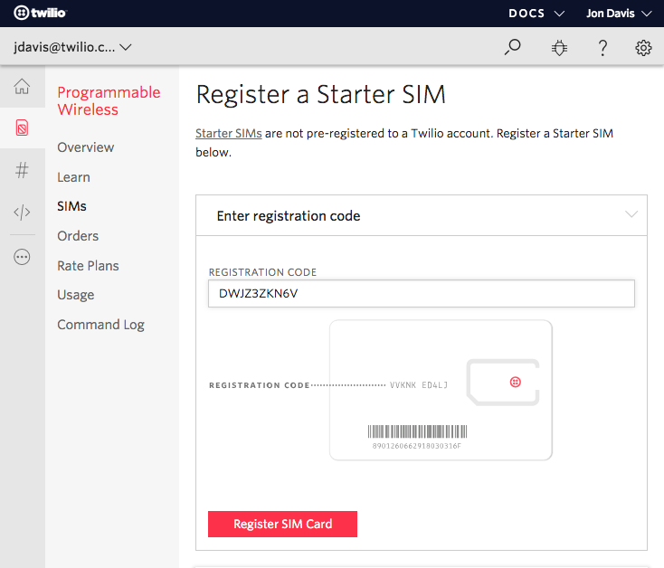

##### Choose a Unique Name

1. Enter a unique name

> This name that will appear in this demo's dashboard. In the screenshots above, I used the unique name "Garage Monitor"

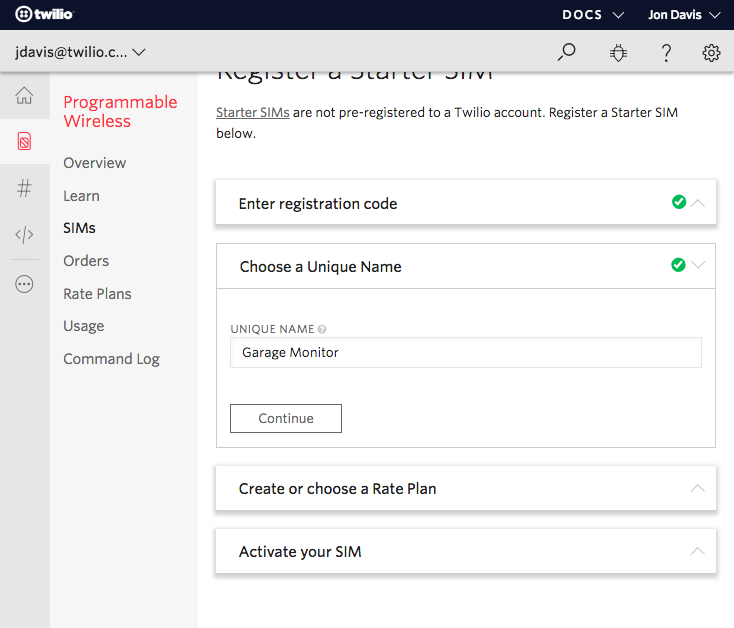

##### Create or choose a Rate Plan

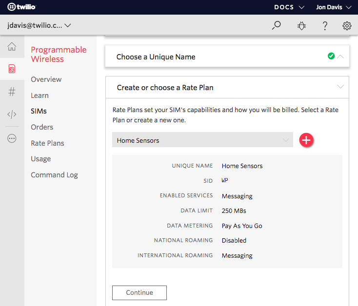

1. Click the red **+ button** to create a new Rate Plan
2. Name your Rate Plan **Home Sensors**
3. Enable the Rate Plan with Messaging
4. Enable National Roaming if necessary
5. Enable International Romaing if outside of the United States
6. Data Limits can be set to any number.

> This demo does not currently use data but there is no harm in enabling it.
  
| Roaming | Definition |
|--|--|
| National  | Allow SIM to roam onto other networks in the United States. With the current Twilio SIMs, this means roaming onto other US operators where possible. |
| International  | Allow SIM to roam on partner networks outside of US. Programmable Wireless does not currently support International Voice. |

> Set your device's APN to wireless.twilio.com so that you can use data if you are outside of the United States.

##### Activate your SIM

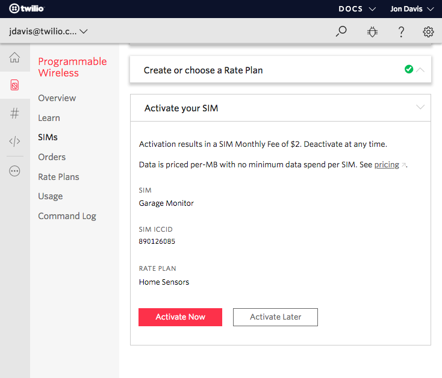

1. Click the red **Activate** button to bring your SIM card online.

##### Find your SIM Sid

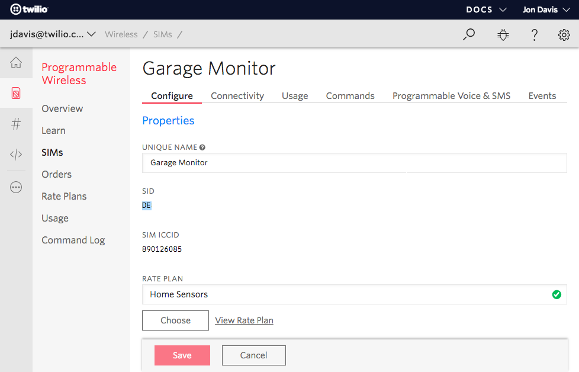

1. Navigate to the [SIMs section of the Console](https://www.twilio.com/console/wireless/sims)
2. Locate your newly created SIM
3. Click on the SIM item
4. Make note of your SIM Sid, you will use this in the next section.

> Your SIM Sid starts with DE and 30+ alpha numeric characters.

### Installation

#### Update Account Sid and Auth Token
This demo can be run locally without deploying to a cloud provider.

1. Open ```server/api/config.js``` in a text editor
2. Update **line 6** with your [Account Sid](https://www.twilio.com/console)
3. Update **line 7** with your [Auth Token](https://www.twilio.com/console)
4. Save your changes

> Updating your Account Sid and Auth Token are the only configuration changes required to run the demo. You will enter your Device Sid in the Dashboard of this team once it's running.

#### Run server locally

Using a Terminal:
1. Make sure Homebrew is installed ```$ /usr/bin/ruby -e "$(curl -fsSL https://raw.githubusercontent.com/Homebrew/install/master/install)"```
2. Type ```brew install node```
3. Navigate to the *server* folder
4. Type `npm install`
5. Type `npm start`
6. Point your web browser to [localhost:5000](http://localhost:5000)

Your demo app is now running locally.

#### Deploy to Heroku

This step is optional. You can run this demo locally without the need of online hosting. Use the following steps if you want to upload this demo to [Heroku](https://www.heroku.com/).

You have two options:
1. Click the **Deploy to Heroku** button below

[](https://heroku.com/deploy?template=https://github.com/jonedavis/wireless-se-demo)

**or follow these manual steps:**

1. Follow the [Getting Started on Heroku with Node.js steps](https://devcenter.heroku.com/articles/getting-started-with-nodejs#set-up)
2. Create a new [Heroku App](https://dashboard.heroku.com/new-app)
3. Click the **Deploy** tab in your new Heroku App
4. Upload the root directory of this repository via *git*

> The root directory contains *app.json* and *Procfile*

5. Click the **Open app** button at the top right hand side of your Heroku App

Your demo app is now running on [Heroku](https://www.heroku.com/).

#### Dashboard

This demo requires a [Sim Sid](https://www.twilio.com/console/wireless/sims) to pull data into the web app.


> See the full story below for more information on getting your Sim Sid.

1. Copy your SIM's **Sim Sid** into the Sim Sid input field

> A SIM Sid starts with DE

2. Click **Save**

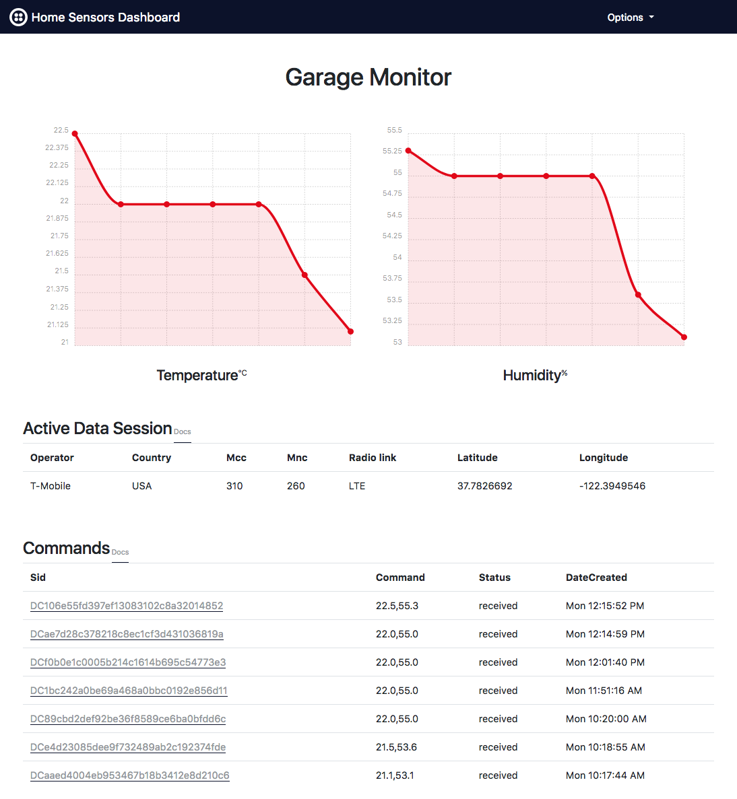

> This screenshot demonstrates how a dashboard displays data from an active device.

After inserting your SIM Sid and clicking Save, your dashboard will be populated with:

1. Sim Resource's unique name
2. Temperature chart
3. Humidity chart
4. Data Sessions table

> This demo does not use data (only Commands), but an online device can return the operator, radio access tower, and estimated geolocation coordinates of the device.

5. Commands table

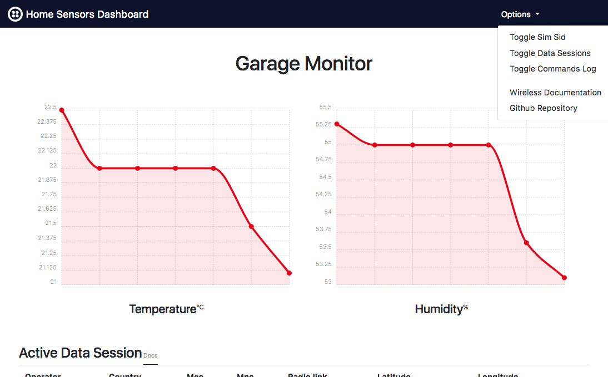

The **Options** dropdown provides you the ability to

1. Change your Sim Sid
2. Show/Hide the Data Sessions table
3. Show/Hide the Commands table
4. Visit [Twilio's Programmable Wireless documentation](https://www.twilio.com/docs/api/wireless)
5. Visit this demo's Github repository

#### Hardware

The [Seeed Wio LTE](https://github.com/SeeedDocument/Wio_LTE) is used in this demo.

##### Insert SIM in the Seeed Wio

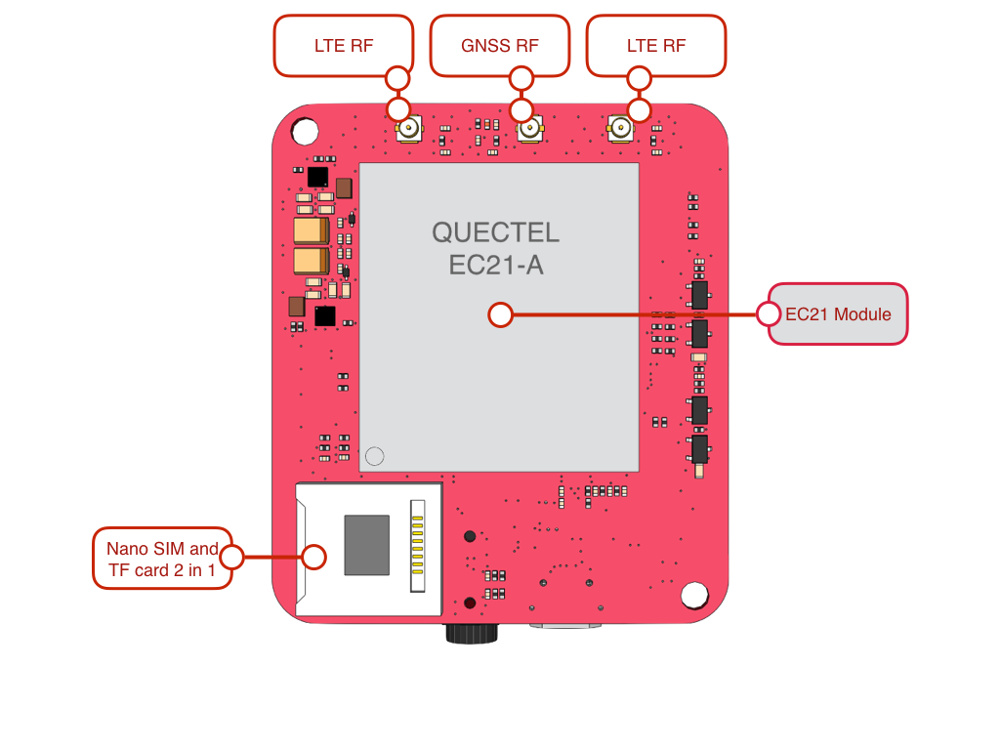

1. Insert the Nano (4FF) SIM size in to the SIM card slot of the Seeed Wio

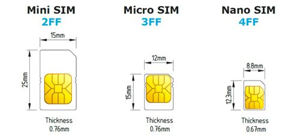

##### Plug in the temperature and humidity sensor

This demo uses the a [grove temperature and humidity sensor](http://wiki.seeedstudio.com/Grove-Temperature_and_Humidity_Sensor_Pro/).

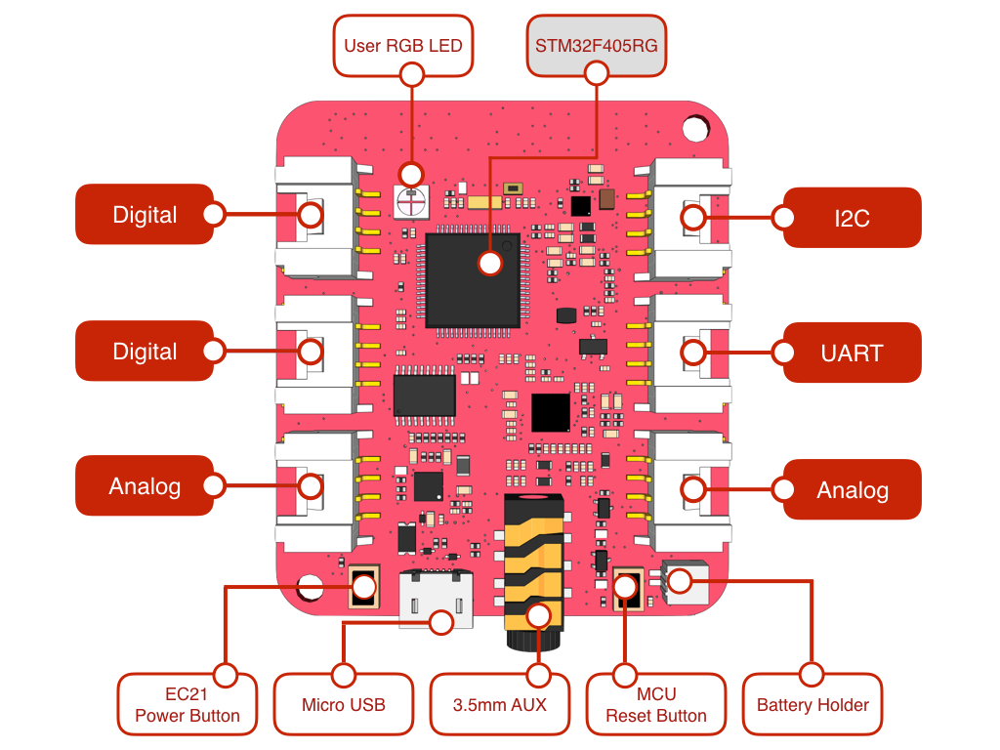

1. Plug the grove port into D38 on the Seeed Wio

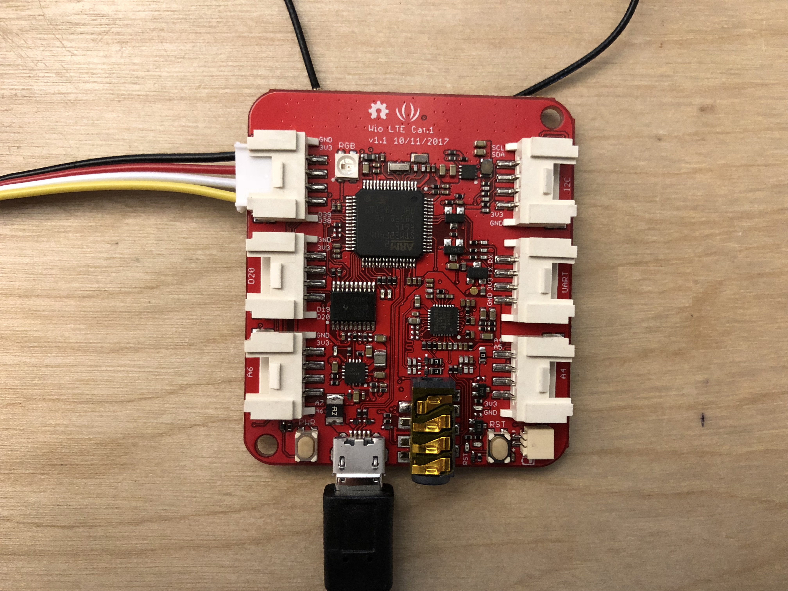

##### Plug in the LTE antennas

The Seeed Wio LTE comes with 2 LTE antennas and a GPS antenna. 

> This demo does not use GPS, but feel free to insert the GPS antenna.

1. Plug each antenna in an LTE port on the back of the Seeed Wio

##### Plug in the USB cable

1. Insert the micro usb cable into the Seeed wio
2. Plug the other end of the USB cable in your computer to install firmware in the next section

The end result should look like the following:

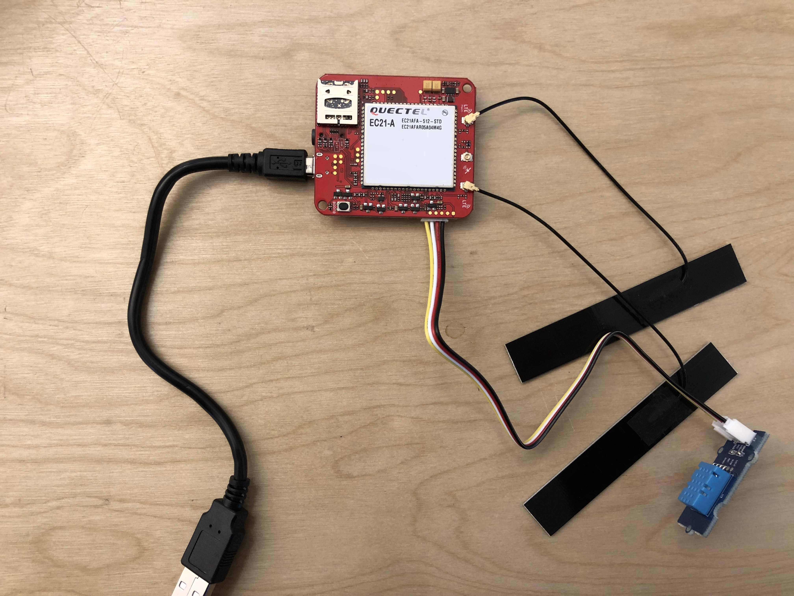

##### Install Espruino web ide

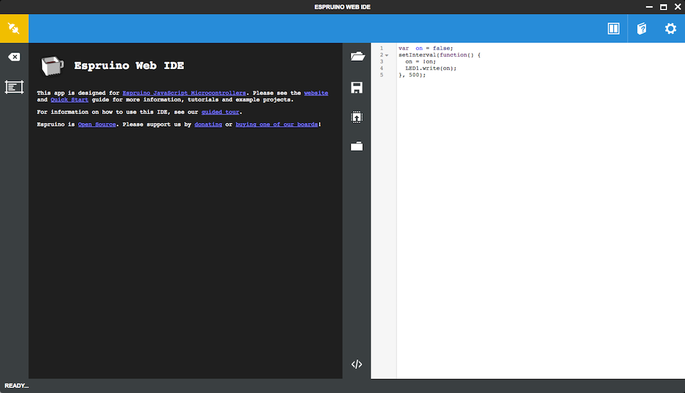

1. Install [Chrome Web Browser](https://www.google.com/intl/en/chrome/browser/)
2.  [Click here to get Espruino Web IDE](https://chrome.google.com/webstore/detail/espruino-web-ide/bleoifhkdalbjfbobjackfdifdneehpo)
3. Run Espruino Web IDE from chrome's home screen or the App Launcher (type `chrome://apps` at the address bar)

##### Copy code into Espruino ide

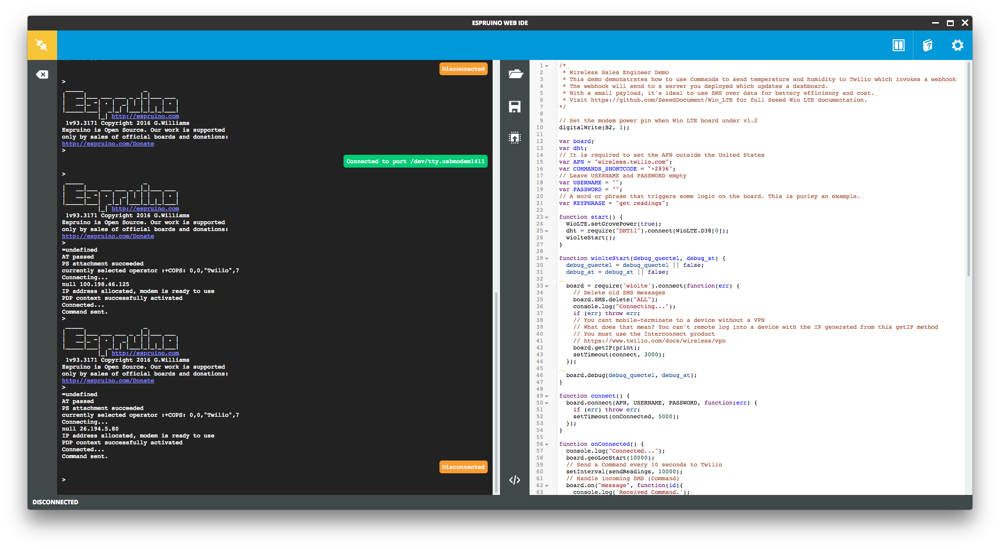

1. Copy the code from [wio/main.js](wio/main.js) into the right-hand side text portion of the IDE

#### Install firmware

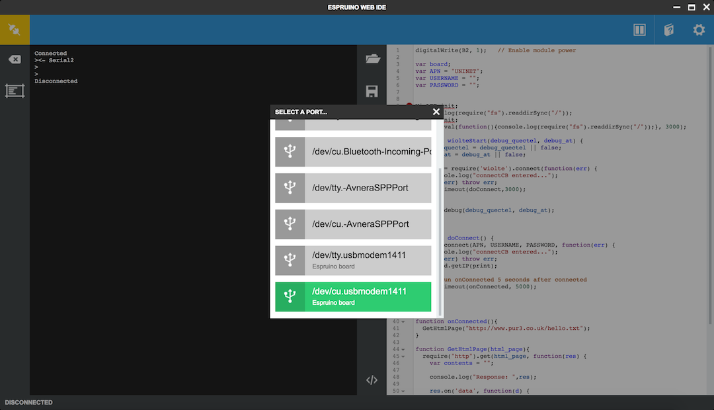

1. Connect the Wio LTE board to computer using a micro USB cable
2. Click the **Send to Espruino** button in the middle of the IDE
3. Choose the Espruino board in the selction box.

> The **Send to Espruino** button looks like a chip with an arrow in it

On device manager you can see a new COM Port device, on MacOS it is `STM32 Virtual ComPort`, on windows it is `STMicroelectronic Virtual COM Port`.

> The format of the Command is simply "{temperature},{humidity}". Temperature is in celsius and relative humidity is a percentage. Relative humidity is the ratio of the current absolute humidity to the highest possible absolute humidity (which depends on the current air temperature).

**That's it!** The code should run and send a Command (over SMS) every 10 seconds with an updated temperature and humidity reading.

> You can update the delay between commands by changing the interval delay on **line 60** of [wio/main.js](wio/main.js).